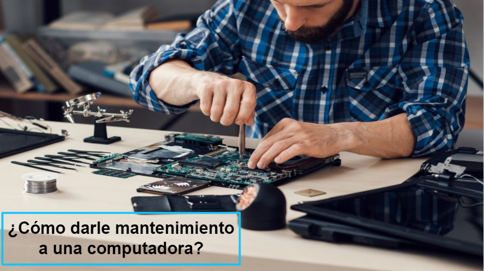

# Taller 1 - **Mantenimiento de una computadora**

## Integrantes (Grupo#7):
Estudiantes:
  * Ayeser Cristián Oxlaj Juarez - 202010025
  * Luis Angel Barrera Velásquez - 202010223
  * Esteban Humberto Valdez Ennati -  202011535
  * Oward Francisco Alberí Sian Solis - 201901807
  * Josué Rodolfo Morales Castillo - 202010033
  
Tutores:
  * Elmer Gustavo Sánchez García
  * Edwin Alfredo Lopez Gomez
  * Frederick Faugier
---
## Contenido:
1. Computadora
    1. Definición
    2. Tipos de computadoras
3. Laptop
    1. Componentes de una laptop
        1. Partes Internas
        2. Partes Externas
    3. Características
5. Mantenimiento de una computadora
    1. Tipos de mantenimiento
    2. Procedimiento
6. Video Explicativo
7. Trifoliar
8. Bibliografía
---
# Computadora :computer:
### Definición
Una computadora es considerada como un dispositivo informático que es capaz de recibir, almacenar y procesar información de una forma útil. Una computadora está programada para realizar operaciones lógicas o aritméticas de forma automática. Su principal funcion es facilitar las tareas.

La computadora tiene su origen en dispositivos que permiten realizar cálculos de forma mecánica como el ábaco y la pascalina.

Charles Babbage inventa en 1882 la llamada 'máquina diferencial' y posteriormente diseña la 'máquina analítica' cuyos elementos como la memoria, el flujo de entrada y el procesador influyeron en posteriores computadoras más avanzadas. La MARK I, basada en dispositivos electromagnéticos, supuso también un hito en este campo.

### Tipos de computadoras
Con el paso de los años, la forma y los propósitos del computador han ido variando, desde los primeros años de la informática en donde las computadoras ocupaban edificios enteros y eran utilizados para complejos cálculos científicos hasta la actualidad, en donde podemos disfrutar de un dispositivo multiuso con una potencia de cálculo increíble en un espacio tan reducido como en un reloj pulsera.

#### 1. Supercomputadoras
Las supercomputadoras son un tipo de equipamiento informático diseñado con el propósito de procesar datos rápidamente y enormes cantidades de información. Otra característica de las supercomputadoras es la enorme cantidad de calor que provocan, de esta manera los fabricantes de estos equipamientos deben preocuparse por el sistema de enfriamiento.

#### 2. Mainframes
Se destinan a manipular cantidades inmensas de información de entrada, salida y almacenamiento. Los mainframes generalmente trabajan con terminales esparcidas en distintas áreas físicas y donde todo el procesamiento es realizado en este mainframe.

#### 3. Computadoras de escritorio
El tipo de computadora personal más utilizado en la actualidad es la computadora de escritorio, la cual podemos encontrar en todo tipo de escenario y realizando las más variadas tareas.

#### 4. Computadoras portátiles
Otro tipo de computadora personal es la llamada notebook, también llamada ***laptop***, la cual básicamente es una computadora con rendimiento y capacidad similares a una computadora de escritorio, pero en un formato que puede ser transportable, debido a que utilizan un monitor del tipo LCD o LED, además de componentes mucho más pequeños y eficientes en términos de uso de energía, un punto más que necesario ya que la principal fuente de alimentación de las computadoras portátiles es una batería.

Tanto los Smartphone como las Tablet podrían ser considerados como otro tipo de computadoras portátiles, ya que son dispositivos que funcionan prácticamente de la misma manera, salvo que con otra forma.

---
# Laptop
## Componentes
Posee todos los componentes necesarios a la mano para trabajar como en cualquier computadora personal, pero simplemente en un empaque mas pequeño y con batería incluida.

### Partes Externas 
Son prácticamente todo lo que podemos ver a simple vista en una laptop:

#### -Pantalla 📺
Una de las partes mas importantes de cualquier computadora es la pantalla. Las laptops hoy en día tienen pantallas que van desde las 10 pulgadas hasta 16-17 pulgadas en los modelos de gama mas alta o para diseñadores y gamers.
Las resoluciones mas comunes en una laptop son 1368×760 en modelos viejos, 1920×1080 en modelos actuales, los tipos de monitores de las laptops normalmente son LCD o LED.

#### -Teclado ⌨️
Los teclados en las laptops están integrados en el chasis justo debajo de la pantalla. Normalmente el tamaño es mas pequeño que el de las computadoras de escritorio ya que no incluyen el teclado numérico.

#### -Mousepad o trackpad 🖱️
El trackpad actúa como nuestro cursor e incluye botones como el mouse, además de incluir en muchos casos funciones extra depende de los movimientos que hagas con distinta cantidad de dedos.

#### -Adaptador de corriente
Las laptops a diferencia de las computadoras necesitan un adaptador de corriente para transformar la energía y cargar la batería de vez en cuando.

#### -Puertos E/S 🔌
Entre estos puertos, normalmente tenemos los famosos puertos USB, puertos HDMI para conectar la laptop a un monitor o televisión externos, puertos SD para memorias de cámara fotográfica, puertos Thunderbolt para múltiples dispositivos y el puerto de conexión de corriente.

#### -Altavoces 🔊
Aunque en muchos casos no son visibles, todas las laptops incluyen altavoces muy sencillos y de baja potencia para un uso cotidiano. 

#### -Webcam 📷
Al igual que las bocinas, la mayoría de las laptops incluye una cámara web y un micrófono para hacer llamadas o video conferencias.

### Partes Internas
Estas superan en numero a las partes externas de la laptop e incluso suelen ser mas que las partes internas de una computadora de escritorio por la estructura de la laptop.

#### -CPU
O unidad central de procesamiento es el cerebro de la computadora, este es un pequeño procesador de unos centímetros que procesa toda la información que solicitamos.

#### -Tarjeta Madre
La tarjeta madre en una laptop es la base en donde se instalan o conectan todos los componentes internos de una laptop. Al igual que en cualquier otro tipo de computadora, la tarjeta madre es la encargada de conectar y permitir que todos los componentes trabajen en conjunto y existen muchos tipos de tarjetas madre de acuerdo al tamaño y forma de la misma.

#### -Memoria RAM
La memoria RAM o de acceso aleatorio es la encargada de guardar la información de rápido alcance en una computadora. Las laptops suelen traer desde 4GB de memoria RAM hasta 32 GB de memoria RAM en los modelos mas caros, siendo 8GB un promedio en la industria hoy en día.

#### -Disco Duro o SSD
Al igual que en las computadoras de escritorio, requerimos de una unidad de almacenamiento ya sea con disco duro o unidad de estado solido para poder guardar la información de manera permanente. 

#### -Batería
Una diferencia importante en las laptops respecto a las computadoras de escritorio es que las laptops tienen batería. La duración de la batería es de 2 horas hasta 12 horas en los modelos que consumen menos energía en promedio.

#### -Antena BT/WiFi
Las laptops hoy en día no suelen incluir un puerto ethernet, el cual las haría menos portátiles, pero para remplazar ese puerto tenemos antenas WiFi y Bluetooth que se encargan de conectarnos a internet y otros dispositivos sin necesidad de cables.

#### -Ventiladores
Las laptops al igual que las computadoras de escritorio generan calor y necesitan expulsarlo de manera eficiente. Aunque el consumo de una laptop suele ser mucho menor al de una PC, las laptops tienen un gabinete muy pequeño y delgado, por lo cual es fácil que se calienten a temperaturas mas altas que una computadora de escritorio.

Para combatir este problema, los fabricantes suelen incluir 1 o 2 ventiladores lo mas silenciosos posibles en las laptops. Solo las laptops mas sencillas y de bajo rendimiento suelen ser totalmente silenciosas y no usar ningún ventilador.

## Características
1. Unidad compacta e independiente diseñada para funcionar con baterías.
2. Tienen más o menos el tamaño de un libro; su nombre proviene de la idea de que hay suficiente espacio para operar una en tu regazo.
3. Todo viene incluido en un pequeño aparato: la unidad central de procesamiento (CPU en inglés), el monitor, el teclado, un dispositivo de ratón, el disco duro y un disco óptico, como el que es para los DVD.
4. Es conveniente en cuanto a la movilidad y permite ahorrar espacio en casa.
5. Permite una buena conectividad.

# Mantenimiento de una computadora ⚙️
Se puede definir Mantenimiento del PC como una serie de rutinas periódicas que debemos realizar a la PC, necesarias para que la computadora ofrezca un rendimiento óptimo y eficaz a la hora de su funcionamiento. De esta forma podemos prevenir o detectar cualquier falla que pueda presentar el computador.

## Tipos de mantenimiento
1. ***Mantenimiento predictivo***
Se trata de un tipo de mantenimiento que se lleva a cabo utilizando herramientas de diagnóstico, con el fin de anticiparse a posibles fallos e intentar evitarlos antes de que se produzcan.
2. ***Mantenimiento preventivo***
Se trata de un tipo de mantenimiento muy frecuente, que se lleva a cabo con el fin nosólo de prevenir posibles fallos y mejorar el funcionamiento de un sistema, sino con el de alargar la vida útil de los distintos componentes del mismo.
El mantenimiento preventivo es útil en muchos aspectos. Permite, por ejemplo, disminuir el número de paradas del sistema o el tiempo de cada parada, reducir el número de reparaciones, o detectar puntos débiles en el sistema que puedan afectar a su funcionamiento.
3. ***Mantenimiento correctivo***
Se trata de la solución que deberá aplicarse cuando el mantenimiento predictivo y el preventivo no hayan funcionado bien o no hayan sido capaces de evitar el fallo.
4. ***Mantenimiento evolutivo***
Es un tipo de mantenimiento que no se dedica a corregir o prevenir posibles fallos, sino a hacer evolucionar los recursos informáticos con los que se cuenta.

---
## Procedimiento (Mantenimiento preventivo)
### Materiales a utilizar:
* Espuma limpiadora.
* Aire comprimido.
* Kit de desarmadores.
* Pañuelo microfibra.
* Pulsera antiestática.
* Objeto metálico.
* Cepillo suave.
* Solucion limpiadora de grasa.

### Pasos:
1. Colocarse la pulsera antiestática y conectarla al objeto metálico, de esta manera se evitará dañar alguno de los componentes internos.

2. Retire la bateria (este paso puede diferir según el modelo de su computadora).

3. Retire el teclado.

4. Remueva el polvo del teclado con el cepillo y limpiar con el aire comprimido. Asi mismo limpiar la zona donde se encuentra el teclado.

    

5. Ensambe el teclado.

6. Con ayuda del kit de desarmadores retire los tornillos y retirar la tapa.

7. Retirar el disipador de calor y limpiar del posible polvo que este pueda tener.

8. Retirar las memorias RAM limpiando los contactos y con la precaucion de no tocar los pines.

9. Retirar y limpiar el lector de disco (algunas computadoras no cuentan con este).

10. Retirar el disco duro o disco de estado solido y limpiar del polvo.

11. Remover el polvo con la brocha y con el aire comprimido del resto de componentes.

12. Ensamblar componentes con el cuidado debido, colocar la tapa y posteriormente la batería.

13. Limpiar las partes externas de la computadora con el pañuelo de microfibra asi como con la espuma limpiadora.

---
# Video explicativo ▶️
En el siguiente video se muestra de una manera detallada los pasos anteriormente descritos, de tal manera que se pueda realizar el mantenimiento de una manera facil y sencilla consiguiendo el estado optimo de un equipo portatil:

---
# Trifoliar📝

---
# Bibliografía 📚

https://pcacademia.com/partes-de-una-laptop/

https://ehorus.com/es/tipos-de-mantenimiento-informatico/

